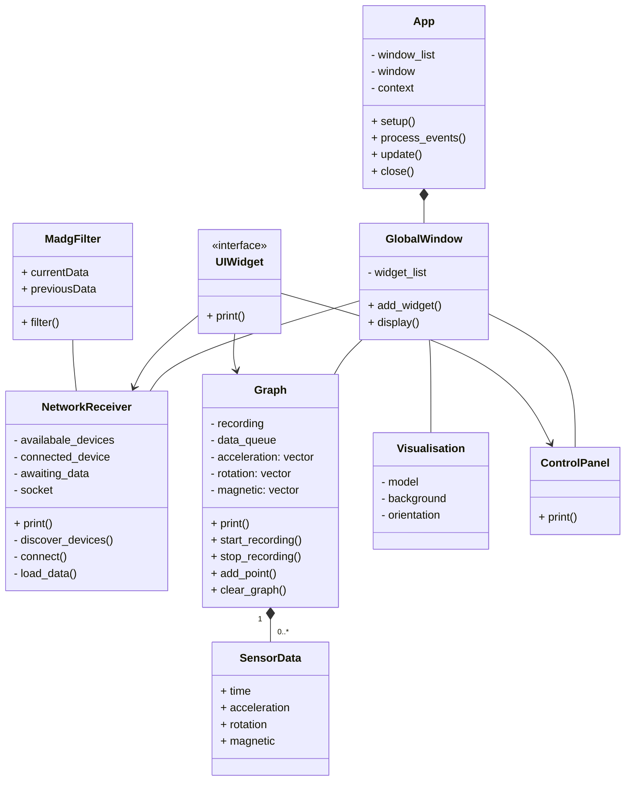

# Flight Data Plotter

## Overview
The Flight Data Plotter is a C++ program utilizing ImGui and ImPlot libraries to provide a user-friendly interface for visualizing flight data. This tool allows users to plot various parameters and analyze flight information in a graphical manner. The program is built using the Conan package manager and CMake for easy dependency management and compilation.

## Features
- **Interactive Interface**: Powered by ImGui, the program offers a sleek and interactive user interface.
- **Real-time Plotting**: ImPlot enables real-time plotting of flight data, ensuring up-to-date visualizations.
- **Customizable Plots**: Users can customize plots by selecting parameters, adjusting colors, and configuring plot settings.
- **Data Import**: Easily import flight data files in common formats for seamless analysis.

## Requirements
- C++ compiler with C++11 support
- Conan package manager
- CMake
- ImGui library (https://github.com/ocornut/imgui)
- ImPlot library (https://github.com/epezent/implot)

## Getting Started
1. Clone the repository.
2. Install dependencies using Conan.

```bash
conan install . --output-folder=build --build=missing
```
for a debug version you can add `--settings=build_type=Debug`

3. Configure and build the project with CMake.

```bash
cmake --preset conan-release
cmake --build --preset conan-release
```

for a debug version you can use `conan-debug`

4. Run the executable.

```bash
./build/Release/flight_data_plotter
```

## Contributing
Feel free to contribute by submitting bug reports, feature requests, or pull requests. Your feedback and contributions are highly appreciated.

## License
This Flight Data Plotter is licensed under the MIT License - see the [LICENSE](LICENSE) file for details.


